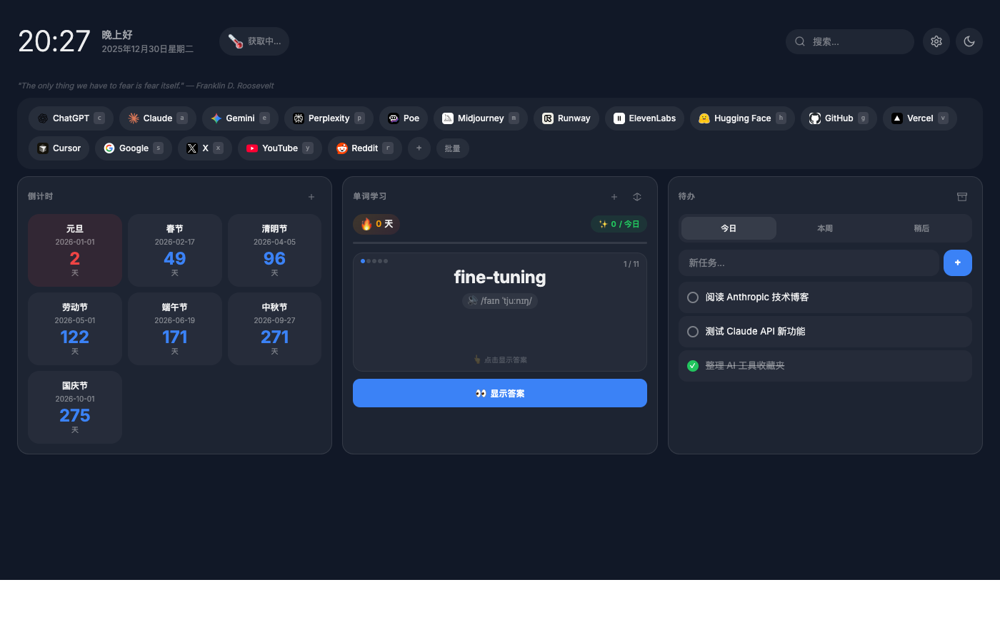
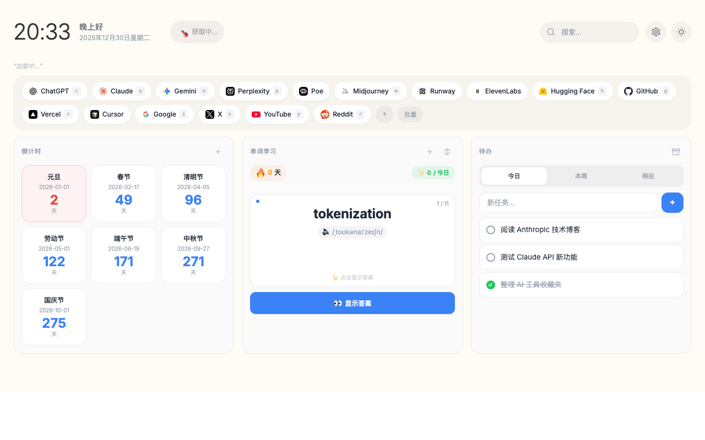

# Start Page

A minimal, privacy-first personal start page with glassmorphism design.

| Dark | Light |
|------|-------|
|  |  |

## Features

- **Quick Links** - Bookmarks with favicons and single-key shortcuts
- **Countdown Timers** - Track important dates with urgency indicators
- **Todo List** - Organize tasks by Today/Week/Later with archive
- **Vocabulary** - Spaced repetition (SM-2) for word memorization
- **Themes** - Dark/Light mode with gradient backgrounds
- **Data Portability** - Batch import links, export all data as JSON

## Usage

Open `index.html` in your browser, or set it as your homepage/new tab page.

### Keyboard Shortcuts

| Key | Action |
|-----|--------|
| `Cmd/Ctrl + K` | Focus search |
| `g`, `s`, etc. | Open link with shortcut |
| `Esc` | Close modal |

### Batch Import Links

Format: `Name | URL | Shortcut (optional)`

```
GitHub | https://github.com | g
Google | https://google.com | s
Twitter | https://twitter.com | t
```

## Tech Stack

- Pure HTML/CSS/JS, zero dependencies
- Single file, ~800 lines
- Glassmorphism UI with CSS backdrop-filter
- localStorage for persistence

## License

MIT
