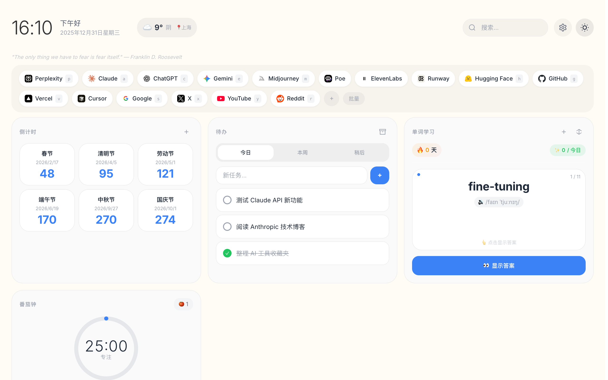
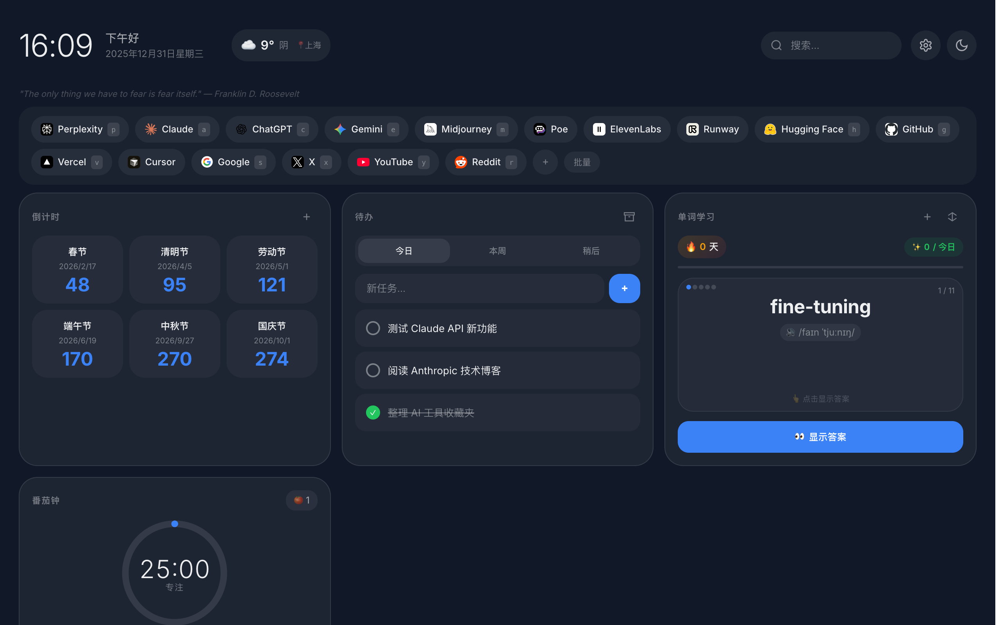

# Start Page

A minimal, privacy-first personal start page with glassmorphism design.

**Live Demo:** [startpage.realtime-ai.chat](https://startpage.realtime-ai.chat)

| Dark | Light |
|------|-------|
|  |  |

## Features

- **First-Time Setup** - 📱 Mobile-first onboarding with theme selection, location setup, and bookmark import
- **Quick Links** - Bookmarks with favicons and single-key shortcuts
- **Pomodoro Timer** - Focus timer with customizable work/break intervals
- **Countdown Timers** - Track important dates with urgency indicators
- **Todo List** - Organize tasks by Today/Week/Later with drag-to-reorder and archive
- **Vocabulary** - Spaced repetition (SM-2) with flashcard design, streak tracking
- **Weather** - Real-time weather via Open-Meteo API with geolocation
- **Daily Quote/Joke** - Toggle between inspirational quotes and jokes
- **Themes** - Dark/Light mode with gradient backgrounds
- **Data Portability** - Batch import links, export all data as JSON
- **PWA Support** - Install as app, works offline

## Usage

Open `index.html` in your browser, or set it as your homepage/new tab page.

### First-Time Setup

New users will see a 5-step onboarding flow:

1. **Welcome** 👋 - Introduction to Start Page
2. **Theme** 🎨 - Choose dark or light mode
3. **Location** 🌍 - Set location for weather (optional)
4. **Import** 🔗 - Quick bookmark import
5. **Tutorial** ✨ - Learn keyboard shortcuts and gestures

To restart onboarding: Settings ⚙️ → 重新引导

### Quick Bookmark Import

During onboarding or via batch import, paste links in these formats:

```
https://google.com                    # Auto-extracts domain name
Google | https://google.com           # Custom name
Google | https://google.com | g       # With shortcut key
```

### Keyboard Shortcuts

| Key | Action |
|-----|--------|
| `Cmd/Ctrl + K` | Focus search |
| `g`, `s`, etc. | Open link with shortcut |
| `Esc` | Close modal |

### Batch Import Links

Format: `Name | URL | Shortcut (optional)`

```
GitHub | https://github.com | g
Google | https://google.com | s
Twitter | https://twitter.com | t
```

## Tech Stack

- Pure HTML/CSS/JS, zero dependencies
- Single file, ~1900 lines
- Glassmorphism UI with CSS backdrop-filter
- localStorage for persistence
- Service Worker for offline support

## License

MIT
