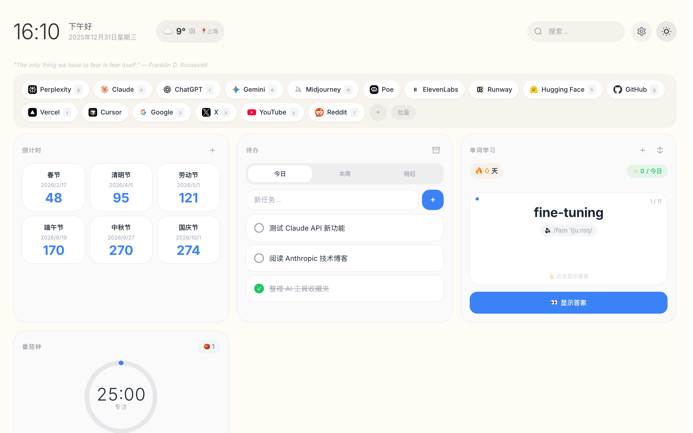
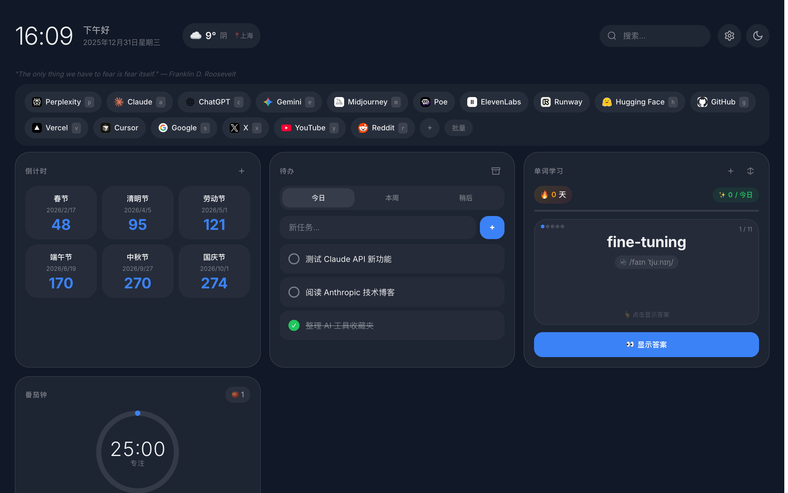

# Start Page

A minimal, privacy-first personal start page with glassmorphism design.

**Live Demo:** [startpage.realtime-ai.chat](https://startpage.realtime-ai.chat)

| Dark | Light |
|------|-------|
|  |  |

## Features

- **Quick Links** - Bookmarks with favicons and single-key shortcuts
- **Pomodoro Timer** - Focus timer with customizable work/break intervals
- **Countdown Timers** - Track important dates with urgency indicators
- **Todo List** - Organize tasks by Today/Week/Later with drag-to-reorder and archive
- **Vocabulary** - Spaced repetition (SM-2) with flashcard design, streak tracking
- **Weather** - Real-time weather via Open-Meteo API with geolocation
- **Daily Quote/Joke** - Toggle between inspirational quotes and jokes
- **Themes** - Dark/Light mode with gradient backgrounds
- **Data Portability** - Batch import links, export all data as JSON
- **PWA Support** - Install as app, works offline

## Usage

Open `index.html` in your browser, or set it as your homepage/new tab page.

### Keyboard Shortcuts

| Key | Action |
|-----|--------|
| `Cmd/Ctrl + K` | Focus search |
| `g`, `s`, etc. | Open link with shortcut |
| `Esc` | Close modal |

### Batch Import Links

Format: `Name | URL | Shortcut (optional)`

```
GitHub | https://github.com | g
Google | https://google.com | s
Twitter | https://twitter.com | t
```

## Tech Stack

- Pure HTML/CSS/JS, zero dependencies
- Single file, ~1900 lines
- Glassmorphism UI with CSS backdrop-filter
- localStorage for persistence
- Service Worker for offline support

## Testing

End-to-end tests run with [Playwright](https://playwright.dev/) and cover every
feature — onboarding, links, search, pomodoro, todos, countdowns, vocabulary,
theme and settings. The suite runs on both a desktop and a mobile viewport.

```bash
npm install
npx playwright install chromium
npm test            # run all tests (desktop + mobile)
npm run test:ui     # interactive UI mode
npm run test:report # open the last HTML report
npm run lint        # ESLint over the test suite
```

Tests load `index.html` directly over `file://` and block external requests, so
they need no server and no network. CI lints and runs the suite on every push
and pull request.

## License

MIT
